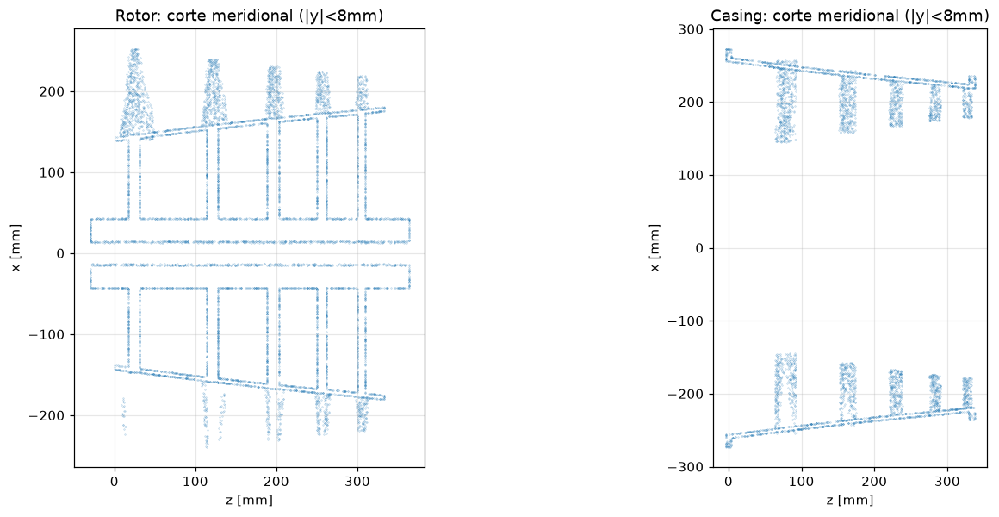
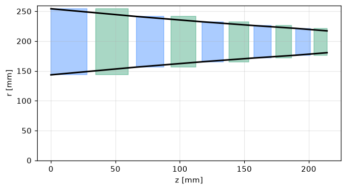
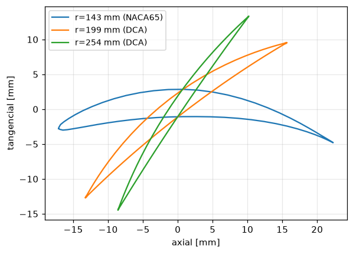
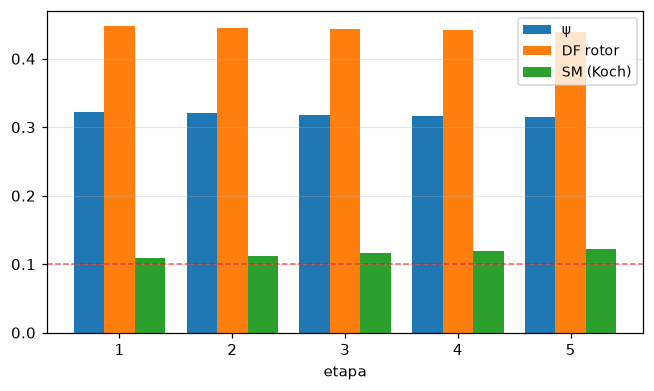
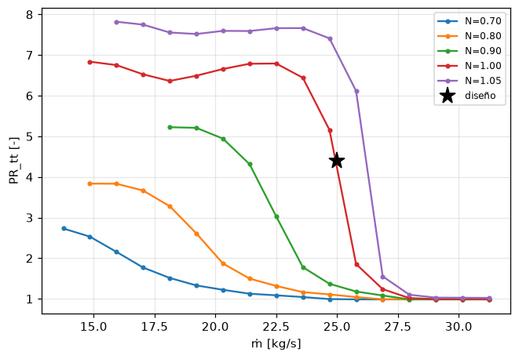

# QUASAR Phy-AC — Diseño autónomo de compresores axiales

<p align="center">
  <a href="LICENSE"></a>
  = 3.10">
  
</p>

<p align="center">
  
</p>
<p align="center"><i>Corte meridional de las piezas imprimibles generadas por la capa 5c (C#/PicoGK) desde un diseño verificado de QUASAR Phy-AC — eje, discos-álabe por etapa y casco del hub (izquierda); anillos de carcasa con vanos de estátor y bridas apernadas (derecha).</i></p>

> **Espec → geometría verificada → piezas imprimibles.** El ingeniero
> escribe seis números (PR objetivo, flujo másico, RPM máx, velocidad de
> punta máx, radio de punta máx, condiciones de entrada) y recibe, en el
> CPU de una laptop y sin proponer geometría alguna: el frente de Pareto
> factible físicamente verificado, el diseño multietapa recomendado, el
> desglose de pérdidas y carga por etapa, las condiciones de frontera de
> CFD, la lista de materiales, **y los STL imprimibles de cada pieza —
> eje, discos-álabe por etapa, y anillos de carcasa con bridas apernadas
> y puerto de sangrado.**
>
> Documentos: [docs/Quasar_PhyAC_Science.md](docs/Quasar_PhyAC_Science.md)
> (ecuaciones, pseudocódigo, referencias) ·
> [docs/VALIDATION.md](docs/VALIDATION.md) (validación física contra
> máquinas NASA). Phy-AC es el hermano axial de **Phy-CC** (compresores
> centrífugos) y comparte su arquitectura: *prior físico calibrado →
> ensemble residual con puerta de incertidumbre → NSGA-II restringido →
> informe autocontenido*.

## Visualización

El `report.html` de cada corrida embebe figuras matplotlib generadas por
[`visualization.py`](visualization.py) (capa 5b, dependencia opcional)
desde el mismo record físico verificado del que salen las tablas: mapa
fuera de diseño, carga por etapa, annulus meridional y secciones de álabe.

<table>
<tr>
<td width="50%"></td>
<td width="50%"></td>
</tr>
<tr>
<td align="center"><sub><b>Annulus meridional</b> — línea media constante; rotores en azul, estátores en verde; la altura de álabe cae con la compresión</sub></td>
<td align="center"><sub><b>Secciones del rotor 1</b> (hub/media/punta, staggered) — twist de free vortex: el stagger crece y la comba cae hacia la punta; DCA sobre M≈0.8, NACA-65 debajo</sub></td>
</tr>
<tr>
<td width="50%"></td>
<td width="50%"></td>
</tr>
<tr>
<td align="center"><sub><b>Carga por etapa</b> — ψ, DF de Lieblein y margen de bombeo de Koch; línea roja = SM mínimo exigido por g</sub></td>
<td align="center"><sub><b>Mapa fuera de diseño</b> — speedlines PR(ṁ) con línea de bombeo y choke (proxy de tendencia L0, geometría congelada)</sub></td>
</tr>
</table>

## Pipeline

```
espec (6 números)
   │   phyac_cli.py · neural_optimizer.design()          [Python, capas 1–4]
   ▼
diseño óptimo verificado (vector θ + record físico)
   │   geometry_generator.py                             [capa 5a]
   ▼
geometry/axial_compressor.json · bom.csv · BCs CFX ────→ report.html [capa 5b]
   │   PhyACImport.FromContractJson(...) + PicoGK        [capa 5c, C#/.NET 9]
   ▼
STLs Shaft + RotorStage{i} + StatorRing{i}  (cada pieza, imprimible)
```

Las capas 1–5b son Python (núcleo: solo NumPy). La capa 5c es la librería
C# **AxialCompressorDesigner** (.NET 9 + paquete NuGet
[PicoGK](https://picogk.org) 2.2.0), que convierte el diseño optimizado en
las piezas reales de la máquina — construcción de turborreactor, partida
donde van las juntas apernadas reales:

| Pieza | Archivo exportado | Contenido |
|---|---|---|
| **Eje motriz** | `<Name>_Shaft.stl` | Eje con muñones de montaje en ambos extremos y barreno central |
| **Disco-álabe** ×N | `<Name>_RotorStage{i}.stl` | Alma del disco + segmento del casco del hub (incl. espaciador bajo su estátor) + álabes de rotor de la etapa i |
| **Anillo de carcasa** ×N | `<Name>_StatorRing{i}.stl` | Segmento del casco + vanos de estátor; el primero y el último llevan las bridas; el de la etapa de sangrado lleva el puerto |
| **Rotor / Carcasa** (vistas) | `<Name>_Rotor.stl` / `<Name>_Casing.stl` | Uniones en posición de marcha |
| **Ensamble** (vista) | `<Name>.stl` | Todo (solo inspección) |

Los planos de corte quedan a mitad del hueco entre el borde de fuga del
estátor de una etapa y el borde de ataque del rotor siguiente; cada disco
calza deslizante sobre el eje.

## Arranque rápido

El CLI tiene interfaz colorizada con arte ASCII, paneles y progreso en
vivo. Lo más fácil es el **asistente interactivo** (Enter acepta los
defaults):

```bash
python phyac_cli.py --interactive        # o -i
```

```bash
# 1. Diseño aerodinámico — humo rápido (~2 min, fidelidad L0):
python phyac_cli.py --pr 4.0 --mdot 25 --quick --fidelity L0 --outdir runs/smoke

#    Corrida completa (con turbo-design instalado, L1 verifica ganadores):
python phyac_cli.py --pr 4.0 --mdot 25 --rpm-max 18000 --utip-max 460 \
    --rtip-max 400 --rounds 5 --n-init 320 --outdir runs/pr4

#    Con pares de calibración CFD (cierra el lazo estilo Noyron):
python phyac_cli.py --pr 4.0 --mdot 25 --hifi-pairs cfx_pairs.json --outdir runs/cal
```

### Controles del ingeniero en el lazo

```bash
# Fijar variables de diseño y optimizar el resto (repetible), semilla propia:
python phyac_cli.py --pr 4 --mdot 25 --fix n_stages=5 --fix phi1=0.60 --seed 42

# Evaluar UN diseño dado (sin optimizar) con los entregables completos
# (las 10 variables de diseño — n_stages,RPM,HTR,phi1,psi_mid,psi_slope,
#  Rx,sigma_r,sigma_s,AR — el punto de operación sale de los flags):
python phyac_cli.py --eval-theta "4,12500,0.62,0.55,0.32,-0.10,0.60,1.20,1.10,2.20" \
    --pr 4 --mdot 25 --outdir runs/eval --map

# Reanudar una corrida desde su checkpoint (el dataset sustituye al LHS):
python phyac_cli.py --outdir runs/pr4 --resume --rounds 3

# Inspeccionar el frente de Pareto verificado de una corrida terminada y
# regenerar los entregables (reporte/geometría/STL) de cualquier punto:
python phyac_cli.py --outdir runs/pr4 --list-pareto
python phyac_cli.py --outdir runs/pr4 --pareto-pick 3 --stl
```

Control de interfaz: `--no-color` (texto plano, respeta `NO_COLOR`),
`--quiet`/`-q` (solo hitos). El estilo vive en
[`cli_style.py`](cli_style.py) (sin dependencias). Ejemplos completos:
`python phyac_cli.py --help`.

### 2. STL imprimibles desde el diseño optimizado (capa 5c)

#### Opción A: generación automática directa (recomendada)

```bash
# Todas las piezas con vóxel default de 0.5 mm:
python phyac_cli.py --pr 4.0 --mdot 25 --quick --stl

# Resolución custom (0.3–0.4 mm para piezas finales):
python phyac_cli.py --pr 4.0 --mdot 25 --quick --voxel 0.4
```

#### Opción B: invocación manual

```powershell
& "C:\Program Files\dotnet\dotnet.exe" build AxialCompressorDesigner.sln
& "C:\Program Files\dotnet\dotnet.exe" `
  "AxialCompressorDesigner.Example\bin\Debug\net9.0-windows\AxialCompressorDesigner.Example.dll" `
  runs\pr4\geometry\axial_compressor.json output\pr4 0.4   # json, outDir, vóxel mm
```

Salidas de la fase Python en `<outdir>/`: `report.html` (autocontenido;
frente de Pareto, tabla por etapa, carta de Smith, desglose de pérdidas,
triángulos, annulus, márgenes estructurales, BCs de CFD y trazabilidad —
más la sección matplotlib si está instalado; se omite con
`--no-figures`), `figures/`, `geometry/` (`axial_compressor.json` — el
contrato schema `phyac-axial-1` que consume la capa 5c —, `annulus.csv`,
`stage_summary.csv`, `bom.csv`, `blade_stage0.step` si CadQuery está
disponible), `dataset.csv` (flywheel de datos), `phyac_run.json`
(checkpoint trazable), `phys_cache.jsonl` (caché persistente de
evaluaciones L1), `map.csv` con `--map`.

Salidas de la fase C#: un STL por pieza más las vistas de unión
(binarios, en mm).

## Mapa de módulos

| Módulo | Capa | Rol |
|---|---|---|
| `physics_core.py` | 1 | Núcleo físico multi-fidelidad: meanline L0 de stage-stacking (θ 13-D, correlaciones Lieblein/Howell/Koch, corrección de Reynolds por fila, $g(\theta)$ ×8, mapa fuera de diseño), spool axial L1 de turbo-design (TD3) con patches y timeout por solve, calibración afín L2, caché, features físicos. |
| `structures_core.py` | 1s | Núcleo estructural L0s: biblioteca de materiales con derating térmico, solver de disco rotatorio 1-D por etapa (validado contra Timoshenko), márgenes de raíz de álabe, AN² y estallido. **Restricción dura del optimizador** vía `DesignSpec.material`. |
| `neural_optimizer.py` | 2–4 | Deep ensemble con incertidumbre + quality gate, NSGA-II con dominancia restringida de Deb, adquisición LCB + k-means, orquestador `design(spec)` — portado de Phy-CC (núcleo agnóstico al dominio). |
| `blade_profiles.py` | 5a | Secciones NACA-65 / DCA sobre comba de arco circular, incidencia de diseño Lieblein/Aungier, desviación de Carter, punto fijo de ángulos metálicos. |
| `geometry_generator.py` | 5a | Secciones spanwise por free vortex (13 estaciones/fila), colocación axial exacta de filas, contrato `axial_compressor.json`, CSVs de annulus/etapas/BOM, BCs CFX, STEP opcional. |
| `data_pipeline.py` | 0 | Política de agregados públicos: anclas de correlación en el repo + manifiesto SHA-256 (sin descargas masivas — ver Science §6). |
| `report_generator.py` | 5b | Informe HTML autocontenido (SVG en Python puro: Pareto, carta de Smith, pérdidas, triángulos, annulus, trazabilidad). |
| `visualization.py` | 5b | Figuras matplotlib (mapa, carga por etapa, annulus, secciones) embebidas como PNG base64. Dependencia opcional con degradación elegante. |
| `AxialCompressorDesigner/` | 5c | Librería C# + PicoGK: importa `axial_compressor.json` (`PhyACImport`) y construye eje, discos-álabe y anillos de carcasa como STL imprimibles. |
| `AxialCompressorDesigner.Example/` | 5c | Ejecutable: CLI `axial_compressor.json → STLs`. |
| `phyac_cli.py` | producto | CLI end-to-end: espec → diseño → geometría → informe → dataset [→ STLs vía --stl/--voxel]. |
| `test_phyac.py` | VV&UQ | Suite de verificación: 63 checks (triángulos, conservación, continuidad de g, perfiles, contrato, solver de disco, núcleo del optimizador, regresión de solapes). |
| `validation/` | VV&UQ | Campaña de validación vs NASA Stage 35, Rotor 37/67 y GE/NASA E³ HPC → `RESULTS.md`. |

## API Python (capas 1–5b)

```python
from neural_optimizer import DesignSpec, design
spec = DesignSpec(PR_target=4.0, massflow=25.0, RPM_max=18_000,
                  U_tip_max=460.0, r_tip_max_mm=400.0,
                  n_stages_max=8, material="Ti-6Al-4V")
out = design(spec)              # → {theta, record, pareto_front, history}
```

## API C# (capa 5c)

La superficie pública son **tres tipos**: la clase de parámetros, el punto
de entrada estático y el importador Phy-AC.

```csharp
using AxialCompressorDesigner;

// Desde una corrida Phy-AC (camino de producto):
var p = PhyACImport.FromContractJson(@"runs\pr4\geometry\axial_compressor.json");
string stlPath = AxialCompressorBuilder.Build(
    p, outputDir: @"C:\ruta\salida", showViewer: false);
// stlPath = ensamble; los STL _Shaft, _RotorStage{i}, _StatorRing{i},
// _Rotor y _Casing se crean al lado
```

La capa C# es deliberadamente **data-driven**: toda la matemática de
álabes (perfiles, ángulos metálicos, free vortex) vive en Python; el
contrato lleva las secciones de comba resueltas por estación de span y el
C# solo transforma, cose y voxeliza (ver
`.agent/axial-compressor-pattern.md`).

### Mapeo axial_compressor.json → Parámetros

| Bloque del contrato | Parámetro(s) C# | Regla |
|---|---|---|
| `annulus.hub` / `annulus.tip` | `HubLine` / `TipLine` | polilíneas [z, r] mm directas |
| `annulus.tip_clearance_mm` | `TipClearanceMm` | holgura de marcha en el extremo libre |
| `stages[i].rotor/stator` | un `RowParams` cada uno | nº de álabes, hueco axial, secciones |
| `sections[j].camber_points` | `SectionParams.CamberPoints` | superficie media de comba, marco de cuerda, centroide en el origen; engrosada con `voxMeshShell` (½·`thickness_mm`) |
| `sections[j].stagger_deg` | `SectionParams.StaggerDeg` | **firmado** (rotor +, estátor −); el builder aplica la rotación firmada uniformemente |
| `structural.drum_inner_r_mm` | `DrumInnerRadiusMm` | radio del eje bajo los discos |
| `assembly.*` | parámetros de eje/discos/bridas/sangrado | detalle de construcción (ver tabla) |

### Parámetros

Todas las distancias en milímetros. Defaults del bloque `assembly` del
contrato entre paréntesis.

| Parámetro | Default | Significado |
|---|---|---|
| `VoxelSizeMm` | 0.5 | Resolución del campo de vóxeles (0.8 borrador, 0.3–0.4 final) |
| `TipClearanceMm` | contrato | Holgura de marcha punta de rotor / hub de estátor |
| `RootSinkMm` | 1.5 | Hundimiento de la raíz del álabe en su cuerpo (soldadura) |
| `ShaftStubMm` | 30 | Muñón del eje a cada lado (asiento de montaje) |
| `ShaftBoreFrac` | 0.35 | Barreno central / radio del eje |
| `HubWallMm` | 5 | Pared del casco del hub (tambor, no tocho macizo) |
| `DiskWebFrac` | 0.5 | Espesor del alma del disco / cuerda axial (acotado 4–14) |
| `FlangeBoltCount` / `FlangeBoltDMm` | 12 / 6 | Círculo de pernos de ambas bridas |
| `FlangeWMm` / `FlangeTMm` | 12 / 8 | Ancho radial / espesor axial de brida |
| `BleedStage` | etapa media | Etapa (1-based) cuyo anillo lleva el puerto de sangrado |
| `BleedHoleDMm` / `BleedBossDMm` / `BleedBossHMm` | 18 / 32 / 14 | Barreno, diámetro y altura del boss del sangrado |

## Geometría (capa 5c)

Convención: **Z es el eje de rotación**; el gas fluye en +Z. Las filas se
construyen como **loft sólido del perfil real**: el contorno cerrado de
cada sección (distribución de espesor NACA-65/DCA de `points`) se vuelve
una malla estanca por álabe — paredes regladas entre costillas + tapas
hub/punta trianguladas LE→TE — voxelizada directa, conservando el radio
de LE y la asimetría presión/succión. Las filas con espesor < 2 vóxeles
(y los contratos legacy sin `points`) caen a la receta v3 de Phy-CC
(lámina de comba + `voxMeshShell`) con **WARNING en el log** cuando el
clamp de espesor actúa. Las filas **IGV y OGV** que la física asume están
en el contrato y cuelgan del primer/último anillo de carcasa. Las raíces
se hunden en su cuerpo; los extremos libres se retraen la holgura para
que el redondeo del vóxel no se coma el gap de marcha. Los huecos axiales
de fila se calculan con la envolvente **exacta** de la comba rotada de
cada sección (el hub corre a mucho menos stagger que la punta), así que
las piezas nunca se solapan — un test de regresión lo cuida.

## Estructura del proyecto

Ver [README.md](README.md#project-structure) (inglés) — el árbol es
idéntico.

## Dependencias

- **Capas 1–5b (Python ≥ 3.10)**: núcleo **solo NumPy**. Opcionales con
  degradación elegante: `turbo-design` v1.4.2 + `cantera` (activa la
  fidelidad L1), `matplotlib` (figuras del informe), `cadquery` (STEP).
- **Capa 5c (C#)**: .NET 9 SDK + runtime x64. PicoGK se resuelve como
  paquete NuGet (`PicoGK` v2.2.0).

Licencias de terceros: ver [README.md](README.md#third-party-licenses).

## Verificación y validación

```bash
python test_phyac.py               # verificación: 63 checks
python validation/validate.py      # validación: máquinas NASA → RESULTS.md
python data_pipeline.py            # anclas de datos: rebuild + SHA-256
```

**Verificación** (¿resolvemos bien las ecuaciones?): identidades de
triángulos, conservación de Euler/entalpía, límite isentrópico,
continuidad del vector g a través del choke, invariantes de
perfiles/contrato (conteos iguales, staggers firmados, sin solape axial),
solver de disco vs Timoshenko exacto, reglas de dominancia de Deb, puerta
del ensemble y reproducibilidad bit a bit (semilla 71).

**Validación** (¿las ecuaciones correctas?): califica el meanline contra
máquinas NASA medidas **sin recalibración por máquina** — el θ de cada
máquina reproduce su annulus publicado y su trabajo medido; se califica la
predicción de pérdidas → (η, PR). Tabla vigente en
[validation/RESULTS.md](validation/RESULTS.md):

| Máquina | ΔPR | Δη |
|---|---|---|
| NASA Stage 35 (etapa transónica) | +0.9% | +1.3 pts |
| NASA Rotor 37 (rotor transónico) | −1.8% | −2.3 pts |
| NASA Rotor 67 (fan transónico) | −1.2% | −2.5 pts |
| GE/NASA E³ HPC (10 etapas) | −4.4% | −1.3 pts |

## Estado actual y límites declarados (v0.1)

- **Parametrización de etapa repetitiva** (ψ_mid + ψ_slope, Rx/φ únicos):
  las máquinas reales varían φ/Rx por etapa — la tolerancia del E³ está
  relajada por esto; es el primer candidato a un θ más rico.
- **Modelo de choque L0**: promedio de choque normal en dos puntos con
  K_SHOCK = 0.70 calibrado en Rotor 37/67; sobre M_punta ≈ 1.5 es
  extrapolación.
- **L1 (turbo-design 1.4.2)** requiere los patches documentados en
  `physics_core.py` §3 y corre en modo meanline (1 streamline) dentro de
  un subproceso con timeout; cada etapa se transforma conservando el
  trabajo. Medido: 95% de solves exitosos, correlación PR r ≈ 0.95 vs L0,
  sesgo sistemático ≈ 0.94 absorbido por `HiFiCalibration`.
- **Álabes**: comba de arco circular con espesor NACA 65-010 / biconvexo,
  impresos como loft sólido del perfil (filas < 2 vóxeles caen a lámina
  de espesor uniforme con WARNING en el log); para álabes custom fieles
  a CFD, el camino es BladeGen/AGF de TD3.
- Materiales con valores típicos de handbook; sustituir por specs
  certificadas para diseño real. El STL de ensamble es solo inspección —
  imprimir las piezas.

## Historia

- **2026-07-17 — holgura de punta por fila**: ε pasa a ser ABSOLUTA en
  mm (crece relativa a los álabes traseros que encogen — el efecto
  físico que un ε/h fijo borraba), con los regímenes de Sakulkaew 2013
  (óptimo bajo 0.8%, ~1.6 pts/1% lineal, punta descargada sobre 3.4%);
  física, contrato de geometría y validación comparten la misma ε (la
  holgura de marcha publicada de cada máquina NASA). Recalibración
  global documentada K_ENDWALL 1.0→1.4; el |Δη| máximo de las cuatro
  máquinas baja de 2.5 a 1.6 pts; REF_AX4 re-congelada.
- **2026-07-17 — álabes de perfil sólido**: la capa 5c hace loft del
  contorno cerrado de cada sección (`points` — la distribución de
  espesor NACA-65/DCA real) a un sólido estanco por álabe, conservando
  el radio de LE y la asimetría presión/succión que la lámina de espesor
  uniforme destruía; la lámina queda como fallback para filas < 2
  vóxeles y contratos legacy, ahora con **WARNING en el log** cuando el
  clamp de espesor actúa (antes era una distorsión silenciosa).
- **2026-07-17 — IGV/OGV**: las filas de guía que la física asume ya
  existen en el contrato y en las piezas 3D — el IGV (axial → pre-swirl
  α₁, delante del rotor 1) cuelga del primer anillo de carcasa y el OGV
  (α₁ residual → axial) del último; la desviación de Carter se
  generaliza con el signo del camber (χ₂ = β₂ − sgn(θ)·δ): las filas
  aceleradoras sobre-giran el metal más allá del ángulo de flujo
  objetivo.
- **2026-07-16 — corrección de Reynolds**: f_Re por fila en las pérdidas
  de fricción (nominal Koch & Smith 1976 a Re_c = 10⁶, exponente
  Wassell/Schäffler, rama laminar bajo 2×10⁵, sin crédito sobre 10⁶ —
  deltas de validación NASA sin cambio, ancla REF_AX4 re-congelada).
- **2026-07-16 — controlabilidad**: CLI con el ingeniero en el lazo
  (`--fix`, `--seed`, `--eval-theta`, warm start `--resume`,
  `--list-pareto`/`--pareto-pick`); `.gitattributes` corrige el fallo
  del hash de anclas por CRLF en clones Windows frescos.
- **2026-07-11 — v0.1**: proyecto creado desde el patrón Phy-CC (θ 13-D
  con radio de punta derivado de continuidad; conversión
  arrastre→pérdida del endwall y normalización de Koch corregidas durante
  la validación NASA; spike de integración TD3 axial con tres patches;
  construcción multi-parte de turborreactor — eje, discos-álabe, anillos
  de carcasa, bridas, puerto de sangrado — tras la revisión de STL que
  encontró solapes rotor/estátor por colocación a stagger medio, ahora
  exacta y con test de regresión).

## Licencia

Copyright 2026 Quasar Solutions Lab. Licenciado bajo
**[Apache License, Version 2.0](LICENSE)**. El software se distribuye
"TAL CUAL", sin garantías ni condiciones de ningún tipo — ver
[LICENSE](LICENSE).
